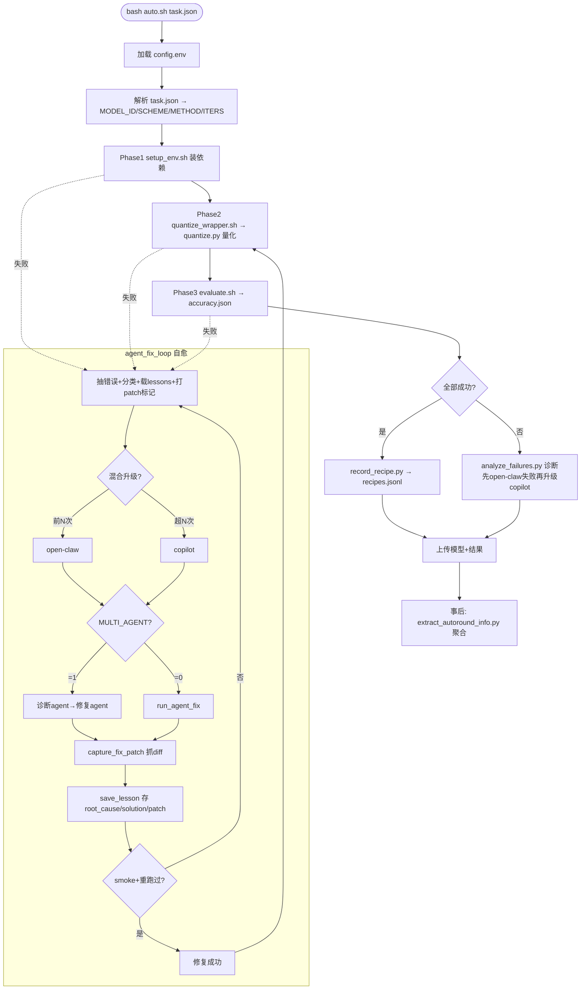

# auto_quant · Agent 集成与流程说明

> 本文档记录 auto_quant 流水线的整体流程,以及本次围绕「Copilot / OpenClaw 混合 agent」的全部改动。
> 所有改动均集中在 `auto_quant/` 下。

---

## 1. 整体流程



### 阶段说明

| 阶段 | 脚本 | 是否 agent | 作用 |
|---|---|---|---|
| 配置 | `config.env` | — | AGENT_BACKEND / 升级 / token / 开关 |
| 解析 | `auto.sh`(内嵌 Python) | — | 读 task.json 得 MODEL_ID/SCHEME/METHOD/ITERS |
| Phase 1 | `phases/setup_env.sh` | 否 | 装 auto-round/transformers/lm_eval + 模型专属依赖 |
| Phase 2 | `phases/quantize_wrapper.sh` → `quantize.py` | 否 | auto-round 量化,含 GPU 强约束 |
| Phase 3 | `phases/evaluate.sh` | 否 | lm_eval 评测 → accuracy.json |
| 自愈 | `phases/agent_fix_loop.sh` | **是** | 任一 phase 失败时 agent 修复 |
| 诊断 | `error_analysis/analyze_failures.py` | **是** | 失败后深度诊断 |

> 量化/评测本体是确定性脚本,**不是 agent**。Agent 只在「出错时」登场。

---

## 2. Agent 登场的两处

| # | 位置 | 时机 | 分发器 | copilot | openclaw |
|---|---|---|---|---|---|
| ① | `agent_fix_loop.sh` | phase 失败 | `run_agent_fix` | `run_copilot_fix` | `run_openclaw_fix` |
| ② | `analyze_failures.py` | 失败后诊断 | `run_agent_analysis` | `run_copilot_analysis` | `run_openclaw_analysis` |

### 两个 backend 的差异

| | copilot | openclaw |
|---|---|---|
| 命令 | `copilot -p "<prompt>" --allow-all-tools` | `openclaw agent --local --session-id ... --message ...` |
| 鉴权 | GitHub token(`COPILOT_GITHUB_TOKEN`/`GH_TOKEN`)或 `copilot login` | `MINIMAX_API_KEY` |
| 模型后端 | GitHub 后端(默认 claude-sonnet) | MiniMax |
| 会话记忆 | marker 文件 + `--continue` | `--session-id` 复用 |
| 输出解析 | 从 stdout 提取 JSON | 从 session JSONL 提取 |

---

## 3. 运行模式

```bash
# 混合升级(默认):便宜先行,难题自动升级
AGENT_ESCALATE=1 AGENT_PRIMARY=openclaw AGENT_ESCALATED=copilot AGENT_ESCALATE_AFTER=2

# 纯 copilot
AGENT_ESCALATE=0 AGENT_BACKEND=copilot

# 纯 openclaw
AGENT_ESCALATE=0 AGENT_BACKEND=openclaw

# 叠加双 agent(诊断→修复)
MULTI_AGENT=1
```

- **fix-loop 升级**:前 `AGENT_ESCALATE_AFTER` 次用 primary(open-claw),之后升级到 escalated(copilot)。
- **诊断升级**:先 primary,若诊断不可用(无 root_cause/suggested_fix/category)则升级 escalated。

---

## 4. 本次改动对比(之前 vs 现在)

| 维度 | 之前 | 现在 |
|---|---|---|
| Agent backend | 只有 open-claw(硬编码) | open-claw / copilot 可切 |
| 疑难处理 | 单 agent 反复重试 | 混合升级(便宜→难题升级) |
| 协作模式 | 单 agent | 可选 multi-agent(诊断→修复) |
| bug fix 记录 | 只存文字 solution | 额外存真实 patch(git diff) |
| 成功配方 | 无 | recipe registry 正向 KB |
| auto-round 信息 | 零散在 lessons | 聚合确认工具 |
| 失败诊断 | 只 open-claw | copilot 可切 + 升级 |

### 修改的文件

- `phases/agent_fix_loop.sh`
  - `run_agent_fix` 分发器 + `run_copilot_fix`
  - `run_multiagent_fix`(诊断 → 修复)
  - `capture_fix_patch`(git diff + 变更文件)
  - fix 循环内混合升级逻辑
  - `save_lesson` 增字段 `patch` / `patch_file` / `patch_has_changes`
- `auto.sh`:成功后调 `record_recipe.py`
- `error_analysis/analyze_failures.py`:`run_copilot_analysis` + `run_agent_analysis` 分发器 + 诊断升级
- `config.env`:新增 `AGENT_BACKEND` / `AGENT_TIMEOUT` / `MULTI_AGENT` / `COPILOT_*` / `AGENT_ESCALATE*` / `PATCH_CAPTURE_DIRS` / `AUTO_ROUND_SRC_DIR`

### 新增的文件

- `recipes/record_recipe.py` — 成功配方 KB(record/query/list → `recipes.jsonl`)
- `error_analysis/extract_autoround_info.py` — auto-round 信息聚合(`autoround_issues.jsonl` + `autoround_report.md`)
- `tests/try_copilot_fix.sh` — 无需 GPU 的 agent 冒烟测试(支持 `MULTI_AGENT=1`)

---

## 5. 测试方法(均无需 GPU)

```bash
# copilot CLI 加入 PATH（如未在 PATH）
export PATH="$HOME/.vscode-server/data/User/globalStorage/github.copilot-chat/copilotCli:$PATH"

# 语法/编译自检
bash -n auto_quant/phases/agent_fix_loop.sh
bash -n auto_quant/auto.sh
python3 -m py_compile auto_quant/recipes/record_recipe.py \
  auto_quant/error_analysis/extract_autoround_info.py \
  auto_quant/error_analysis/analyze_failures.py

# 单 agent 修 bug + patch 捕获
bash auto_quant/tests/try_copilot_fix.sh

# 双 agent（诊断→修复）
MULTI_AGENT=1 bash auto_quant/tests/try_copilot_fix.sh

# recipe registry
python3 auto_quant/recipes/record_recipe.py --store /tmp/r.jsonl record \
  --model Qwen/Qwen3-0.6B --scheme W4A16 --method RTN --iters 0
python3 auto_quant/recipes/record_recipe.py --store /tmp/r.jsonl query --model Qwen/Qwen3-0.6B

# auto-round 信息聚合（真实仓库数据）
python3 auto_quant/error_analysis/extract_autoround_info.py --repo-dir .

# 完整 pipeline（需 NVIDIA GPU）
bash auto_quant/auto.sh <task.json>            # --dry-run 可仅看解析
```

---

## 6. 注意事项

- **鉴权**:copilot 用 GitHub fine-grained PAT(需 "Copilot Requests" 权限)或 `copilot login`;经典 `ghp_` token 不支持。token 建议用环境变量注入,不要提交到 git。
- **XPU/无 GPU**:量化/评测本体是 CUDA 脚本,XPU 机器跑不通;agent 侧(修复/诊断)不需要 GPU。
- **成本**:copilot token 消耗远高于 open-claw,故默认「便宜先行,难题升级」。
